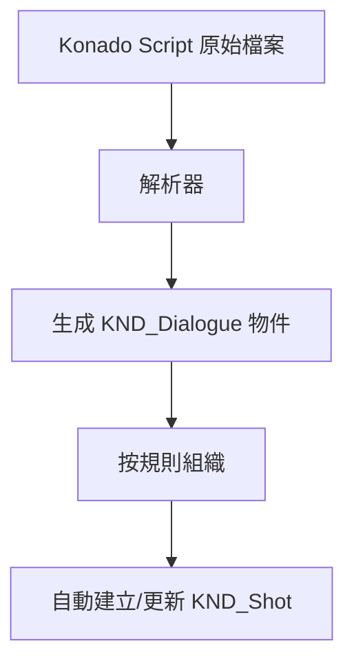

# KND_Shot 以及 KND_Dialogue

## 前言

本章節將介紹 Konado 的兩個核心類別：KND_Shot 和 KND_Dialogue。這兩個類別是 Konado 的核心，用於表示對話鏡頭和對話。如果您希望深入瞭解 Konado 的架構原理，那麼理解這兩個類別是非常重要的。在充分理解這兩個類別的基礎上，您可以根據自己需要，對它們進行擴充和修改，以滿足您的需求。

## KND_Shot

### 定義

KND_Shot 是 Konado 的一個核心類別，用於表示一個對話鏡頭。

鏡頭是影視以及動畫製作中的一個基本概念，它表示一個連續的畫面，通常包含一系列的影格。在這裡，KND_Shot 類別用於表示一個對話鏡頭，其中包含了一系列對話。

當然也可以用書本的概念來理解，一個鏡頭就是一個小章節，一個對話鏡頭就是一個小章節中的對話。

KND_Shot 將負責組織零散的 KND_Dialogue 資料物件，並按照一定的順序排列它們，以便在播放時能夠按照指定順序播放。

當然，與電影鏡頭不同，KND_Shot 並不一定表示連續的、線性的故事，而是可能由多個 `branch` 分支組成，每個分支都包含一系列的對話，搭配 `choice` 來實現多選分支，讓使用者選擇不同的對話路徑。

### KND_Shot 與 Konado Script 的關係

在使用過程中您不難發現，預設情況下，KND_Shot 並不需要手動建立，而是由 Konado Script 自動建立，並且自動更新資料的。這是由於我們採用了自定義的 Konado Script 語法，並使用了 Konado Script 的解析器來解析腳本檔案，透過將原始檔案的行解析成 KND_Dialogue 物件，然後根據一定的規則將它們組織成 KND_Shot 物件。

如果用流程圖來表示，那麼從 Konado Script 到多個 KND_Dialogue 到 KND_Shot 的過程大致如下：

如果您想詳細瞭解 Konado Script 的解析過程，可以參考 Konado Script 的相關文件以及解析器的原始碼。