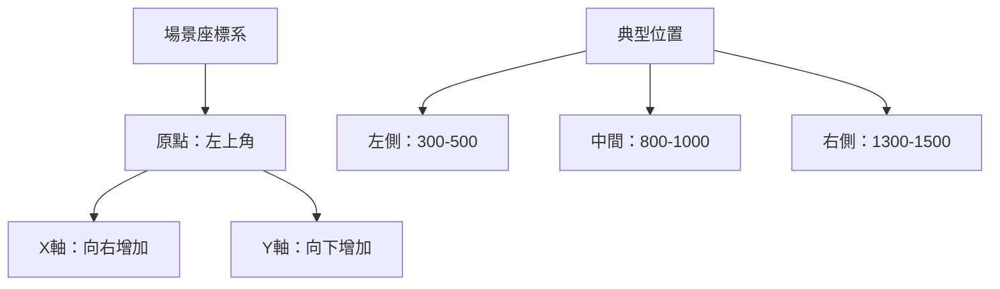

# 演員座標與縮放

## 場景座標系

對話中，演員的座標決定了他們相對於場景的位置。原點位於左上角，X 軸向右增加，Y 軸向下增加。

## 演員縮放比例

演員的縮放比例決定了他們在場景中的大小。原點位於左上角，X 軸向右增加，Y 軸向下增加。

## 參考解析度比例

為了適應不同解析度比例的裝置，演員的座標和縮放比例是相對的，而不是絕對的。因此在專案中應確定統一的解析度比例作為參考，並按照該比例設定演員的座標和縮放比例。

推薦使用 `1920x1080` 作為參考解析度比例，這樣可以兼顧電腦和手機等不同裝置。

如果你的目標裝置解析度比例是固定的（如一些遊戲機裝置），那麼你可以使用該裝置的解析度比例作為參考，無需考慮其他裝置。